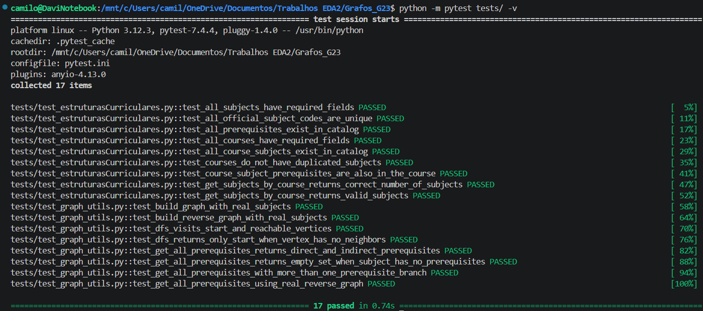

# Validador de Matrícula em Disciplinas

**Número da Lista**: 4<br>
**Conteúdo da Disciplina**: Grafos<br>

## Alunos
| Matrícula | Aluno |
| -- | -- |
| 23/1011220  |  Davi Camilo Menezes |
| 23/1026714  |  Euller Júlio da Silva |

## Apresentação do trabalho
[Link para o vídeo de apresentação]()

## Sobre
O **Validador de Matrícula em Disciplinas** é um trabalho desenvolvido para auxiliar estudantes, do campus UnB Gama, na verificação de matérias que podem ser cursadas com base nos pré-requisitos já concluídos. O objetivo do projeto é simular uma situação real de matrícula acadêmica, em que o aluno escolhe seu curso (uma das 5 engenharias), informa as disciplinas já cursadas anteriormente, e seleciona aquelas que pretende cursar no próximo semestre.

Para isso, o sistema utiliza **grafos direcionados** para representar a relação entre disciplinas e pré-requisitos. Cada disciplina é tratada como um vértice, enquanto cada relação de dependência é representada por uma aresta direcionada. No grafo normal, uma aresta indica que uma disciplina libera outra, enquanto no grafo reverso, a direção das arestas é invertida, permitindo consultar quais pré-requisitos uma disciplina possui.

Com isso, a aplicação utiliza **busca em profundidade (DFS)** sobre o grafo reverso para, dessa forma, encontrar todos os pré-requisitos diretos e indiretos de uma disciplina planejada. A partir dessa busca, o sistema compara os pré-requisitos encontrados com as disciplinas concluídas pelo estudante, informando se a matrícula está liberada ou bloqueada. Por fim, além disso, a interface apresenta os caminhos de dependência, permitindo visualizar de forma clara a sequência de disciplinas necessária até chegar à matéria desejada.

## Screenshots
A seguir estão imagens do projeto em funcionamento.


*Figura 1: Visão inicial da interface selecionando o curso de Engenharia de Software, por exemplo.*


*Figura 2: Visão geral da interface selecionando o curso de Engenharia de Software, por exemplo. Aqui vemos a escolha das matérias concluídas (C1, C2, FAC, EDA1 e seus respectivos pré-requisitos lógicos, nesse exemplo) e as disciplinas pretendidas (Sistemas Distribuídos e Embarcados, nesse exemplo). Logo abaixo, os alertas de validação informam se as disciplinas pretendidas estão liberadas ou bloqueadas.*


*Figura 3: Seção dos "Caminhos de Dependência", contendo a legenda de cores e os grafos SVG gerados pelo Graphviz. Os blocos em verde indicam as disciplinas já cursadas, em amarelo as que faltam, e as caixas azuis ou vermelhas indicam o status da disciplina pretendida no final do fluxo.*


*Figura 4: Execução dos testes automatizados do projeto, validando a construção do grafo direcionado, do grafo reverso, a busca em profundidade (DFS) e a identificação de pré-requisitos diretos e indiretos. Esses testes ajudam a garantir que a validação de matrícula funcione corretamente a partir das relações entre disciplinas.*

## Instalação
**Linguagem**: Python<br>
**Framework**: Streamlit<br>
**Pré-requisitos:** Python 3.10+ instalado e `pytest` para rodar os testes<br>

### Como rodar

1. Clonar o repositório para a sua máquina
```bash
git clone https://github.com/eda2-2026/Grafos_Validador-de-matricula-em-disciplinas.git
```

2. Navegar até o diretório do projeto
```bash
cd Grafos_Validador-de-matricula-em-disciplinas
```

3. Instalar as dependências
```bash
python -m pip install -r requirements.txt
```

4. Executar a aplicação
```bash
python -m streamlit run app.py
```

5. Rodar todos os testes
```bash
python -m pytest tests/ -v
```

**Observações**
- A aplicação é executada localmente por meio do *Streamlit* e disponibilizada em uma interface web, a qual é aberta automaticamente no navegador.
- Se `python` não estiver disponível no seu terminal, use `python3` nos comandos acima.

## Uso
Explique como usar seu projeto caso haja algum passo a passo após o comando de execução.
