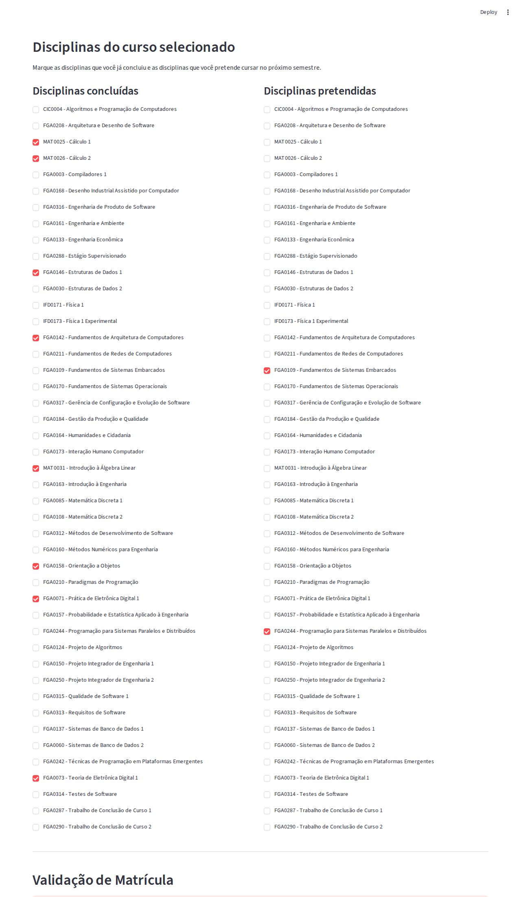

# Validador de Matrícula em Disciplinas

**Número da Lista**: 4 
**Conteúdo da Disciplina**: Grafos 

## Alunos
| Matrícula | Aluno |
| -- | -- |
| 23/1011220  |  Davi Camilo Menezes |
| 23/1026714  |  Euller Júlio da Silva |

## Apresentação do trabalho
[Link para o vídeo de apresentação]()

## Sobre
Descreva os objetivos do seu projeto e como ele funciona. 

## Screenshots

*Figura 1: Visão inicial da interface selecionando o curso de Engenharia de Software.*

*Figura 2: Visão geral da interface selecionando o curso de Engenharia de Software. Aqui vemos a escolha das matérias concluídas (C1, C2, FAC, EDA1 e seus respectivos pré-requisitos lógicos) e as disciplinas pretendidas (Sistemas Distribuídos e Embarcados). Logo abaixo, os alertas de validação informam se as pretendidas estão liberadas ou bloqueadas.*

## Instalação
**Linguagem**: xxxxxx 
**Framework**: (caso exista) 
Descreva os pré-requisitos para rodar o seu projeto e os comandos necessários.

## Uso
Explique como usar seu projeto caso haja algum passo a passo após o comando de execução.

## Outros
Quaisquer outras informações sobre seu projeto podem ser descritas abaixo.
